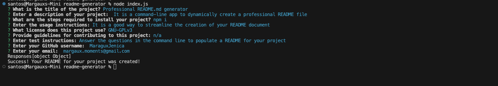
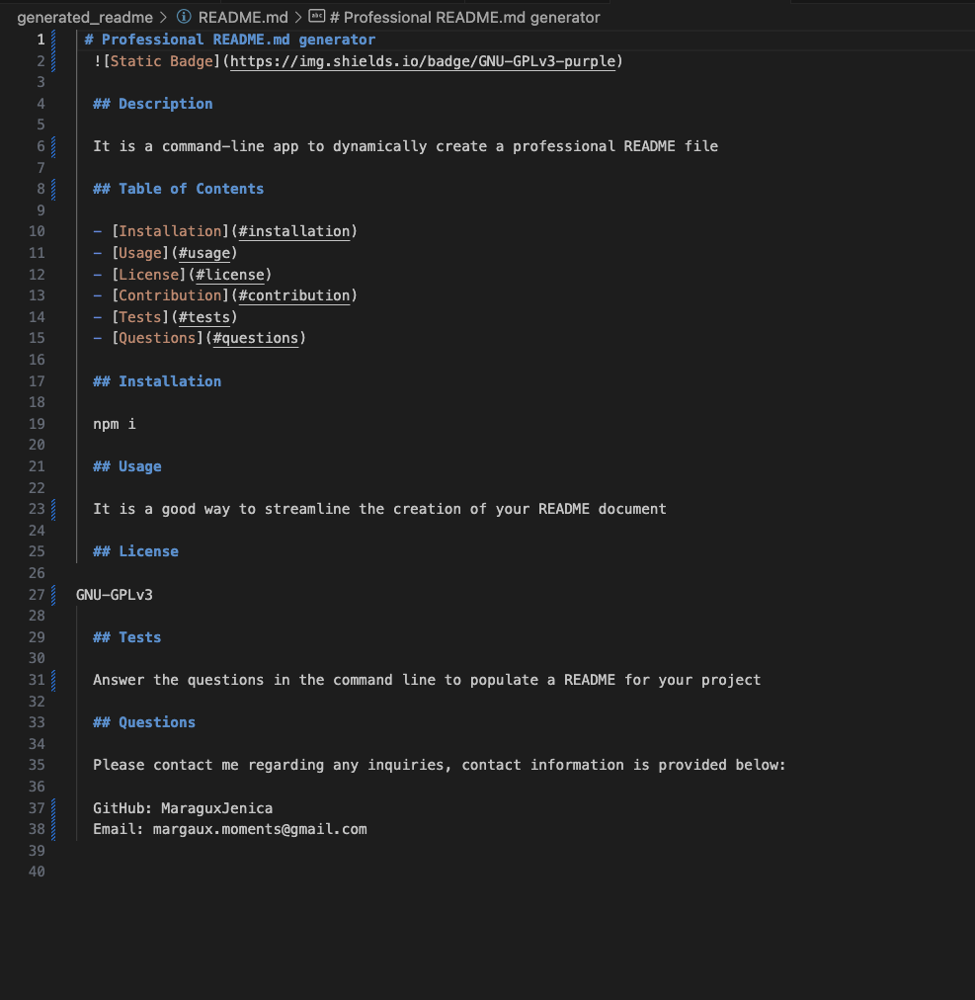
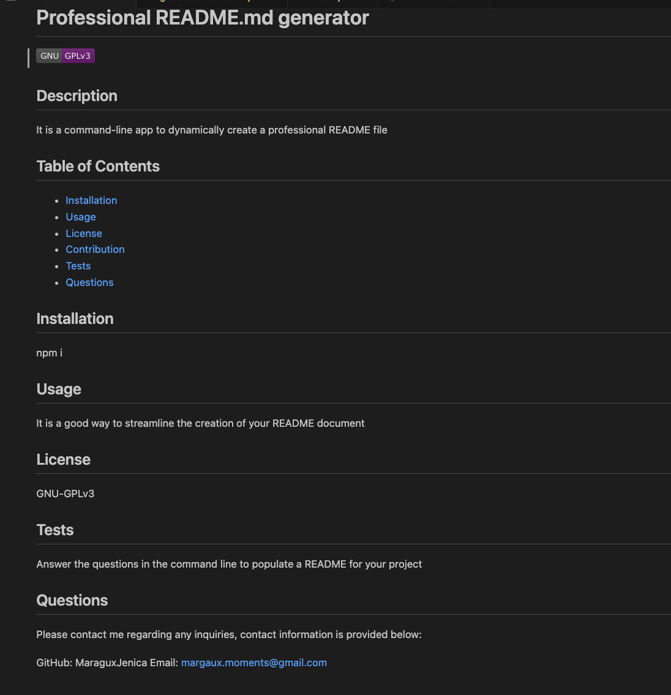

# readme-generator

## Description

The objective of this project is s to build a command-line application that streamlines the process of generating a high-quality README.md file, enhancing the overall documentation and potential collaboration on your open-source project.To achieve this, you'll be utilizing the Inquirer package to prompt the user for input. The application should be invoked with the command node index.js, and it should generate a comprehensive README file based on the provided user input.

    1. User is prompted for information regarding their project then a high-quality README.md is generated 
    2. Includes title, description, Table of Contents, Installation, Usage, License, Contribution Guidelines, Tests, and Contact for questions
    3. Table of content can navigate reader to specified portions of the document.   

 The README file is a crucial component of any GitHub repository, providing essential information about the project, such as its purpose, usage instructions, installation process, reporting issues, making contributions, and more.

## Final Product
### Command-line with answered prompts

### README.md file 

### Generated README Preview

## [README.md Generator](https://margauxjenica.github.io/readme-generator/)
Link to video walkthrough: https://drive.google.com/file/d/1-ajYx6TLOQqxovJUhUbh3ysMTCbxIdHU/view?usp=drive_link